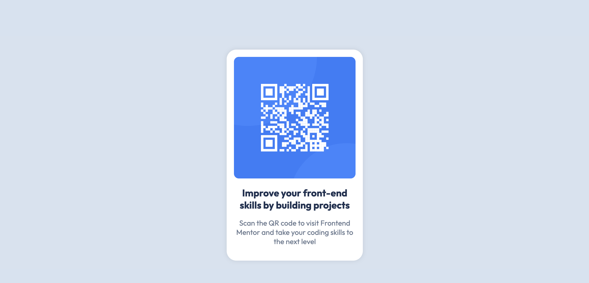

# Frontend Mentor - QR code component solution

This is a solution to the [QR code component challenge on Frontend Mentor](https://www.frontendmentor.io/challenges/qr-code-component-iux_sIO_H). Frontend Mentor challenges help you improve your coding skills by building realistic projects.

## Table of contents

- [Overview](#overview)
  - [Screenshot](#screenshot)
  - [Links](#links)
- [My process](#my-process)
  - [Built with](#built-with)
  - [What I learned](#what-i-learned)
  - [Continued development](#continued-development)
  - [Useful resources](#useful-resources)
  - [AI Collaboration](#ai-collaboration)

## Overview

### Screenshot

### Links

- Solution URL: [github](https://github.com/becediego/fe-mentor-qr-code-project)
- Live Site URL: [github page](https://becediego.github.io/fe-mentor-qr-code-project/)

## My process

### Built with

- Semantic HTML5 markup
- CSS
- [Styled Components](https://styled-components.com/) - For styles

### What I learned

I am starting from the very beginning. I watched some YouTube tutorials to understand basic HTML and CSS syntax. I was able to define an initial structure and style it with CSS. Margins were particularly difficult for which a couple of additional reads clarified things. I think I understood the point of Figma. It was very helpful for correctly coding sizes and margins. I didn't focus too much in optimizing everything. From past experiences in other languages I try to learn the best ways to do some things right from the start and I end up not doing anything. This time my goal was building the most basic code. Hard to change the mindset but it definitely challenges me to make the mistakes and learn from them.

### Continued development

For this project JS is not needed but that's probably the next thing I will focus

### Useful resources

- [Margins](https://www.smashingmagazine.com/2019/07/margins-in-css/) - This helped me understand the basics of margins and what seems to be normal problems when starting
- I leveraged the use of cursor AI, especially for CSS styles. The AGENTS file prevented it from giving me a solution which helps the learning process

### AI Collaboration

Describe how you used AI tools (if any) during this project. This helps demonstrate your ability to work effectively with AI assistants.

- Cursor
- CSS styling and debugging
- Asking questions of how it would build a certain structure and why is that the best approach
